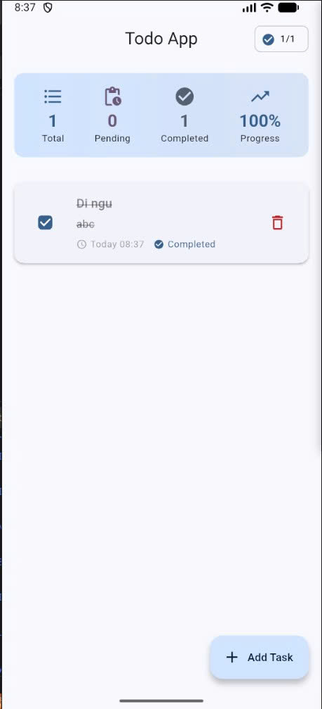

# ✅ Lab 2: Todo App - Clean Architecture

Ứng dụng Flutter giúp **quản lý công việc cá nhân** với giao diện hiện đại, hoạt động **hoàn toàn offline** và tuân thủ **Clean Architecture**.

---

## 🚀 Mục tiêu

- Quản lý danh sách công việc hiệu quả  
- Áp dụng **Clean Architecture** & **SOLID**  
- Lưu trữ dữ liệu offline bằng **SharedPreferences**  
- Quản lý state với `setState()`  
- Giao diện hiện đại, hỗ trợ **Responsive**  

---

## 🧩 Tính năng chính

- ➕ Thêm, xóa, chỉnh sửa công việc  
- ✅ Đánh dấu hoàn thành công việc  
- 📊 Thống kê tiến độ và tỷ lệ hoàn thành  
- 💾 Lưu trữ dữ liệu **offline** không cần internet  

---

## ⚙️ Cài đặt & Chạy

```bash
flutter pub get
flutter run
```

> 💡 Có thể chạy trên Android, Windows hoặc Chrome.

---

## 📸 Giao diện ứng dụng



---
